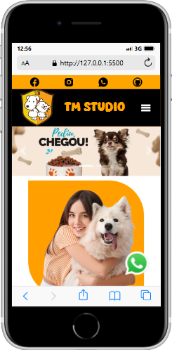
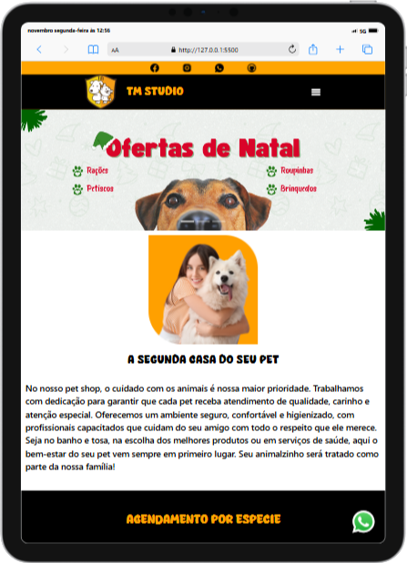
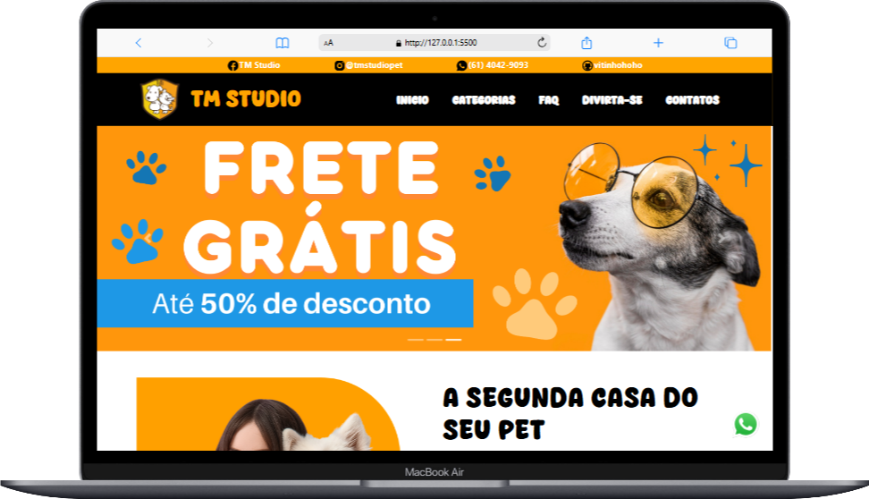

# TM Studio Pet 🐾 

TM Studio Pet é um site responsivo criado para promover serviços, produtos e informações relacionados a cuidados e diversão para pets. O objetivo do site é oferecer uma experiência agradável para os visitantes, independentemente do dispositivo que eles estejam utilizando.

## 📂 Estrutura do Projeto

O projeto contém as seguintes seções principais:

- **Início**: Apresentação do site com informações sobre a marca.
- **Categorias**: Destaque de produtos ou serviços disponíveis.
- **FAQ**: Respostas às perguntas mais frequentes.
- **Divirta-se**: Seção interativa para entretenimento.
- **Contatos**: Formulário de contato e localização.

## 🎨 Cores e Fontes

- **Fontes**:
  - **Cream Beige**: Uma fonte exclusiva e elegante para o logo e elementos principais do site.
  - **Segoe**: Fonte limpa e moderna usada para os textos e informações gerais.

- **Cores**:
  - **Black (#000000)**: Para o fundo e textos principais, proporcionando um contraste forte.
  - **White (#FFFFFF)**: Usado para detalhes, como textos secundários, fundos de áreas e ícones.
  - **Orange (#FFA500)**: Cor vibrante que chama atenção para botões de ação, links e outros elementos interativos.

  
  
  

## 🖥️ Tecnologias Utilizadas

- **HTML5**: Estrutura do site, definindo os elementos e conteúdo.
- **CSS3**: Estilização e design responsivo, incluindo o uso de Media Queries para garantir a adaptação em diferentes dispositivos.
- **JavaScript**: Interatividade, como o menu responsivo e animações dinâmicas.
- **Fontes Customizadas**: Inclui a fonte `Cream Beige` para um design exclusivo que se destaca e transmite um toque acolhedor.

## 🎨 Responsividade

O site foi projetado para ser acessível e funcional em diferentes dispositivos:

### **Celulares**

    

### **Tablets**

    

### **Notebooks**

    

### **Desktops**

### Ajustes Responsivos Incluem:

- **Menu Adaptativo**: Para dispositivos menores, o menu é ajustado para um ícone de hambúrguer, garantindo uma navegação intuitiva.
- **Reorganização de Layout**: Elementos são reposicionados para melhor aproveitamento de espaço em telas menores, sem perder funcionalidade.
- **Ajustes Dinâmicos**: Tamanhos de fontes, margens e espaçamentos são ajustados automaticamente conforme o tamanho da tela, proporcionando uma leitura confortável.

## 👨‍💻 Desenvolvedor

- **Nome**: Vitor Espíndola 
- **Email**: [vitorespindola2011@hotmail.com]
- **GitHub**: [https://github.com/vitinhohoho](https://github.com/vitinhohoho)

---

Se tiver dúvidas ou sugestões, entre em contato!